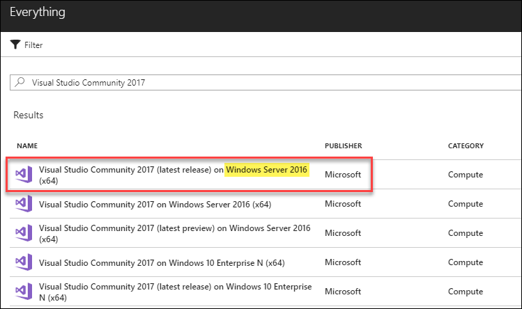
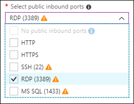
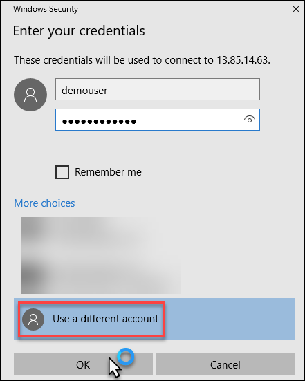
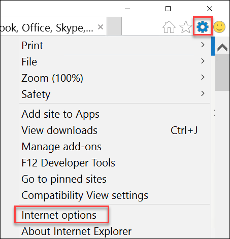
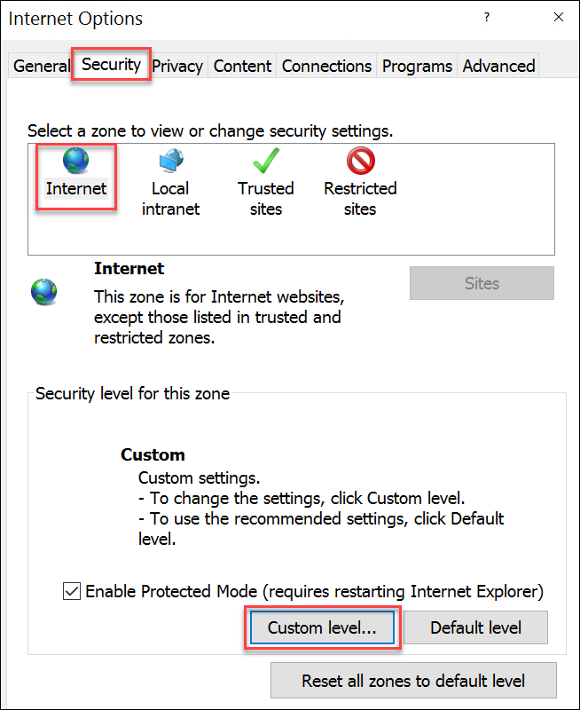
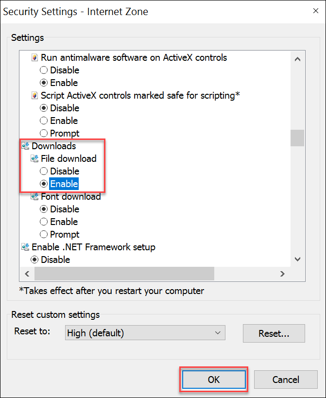
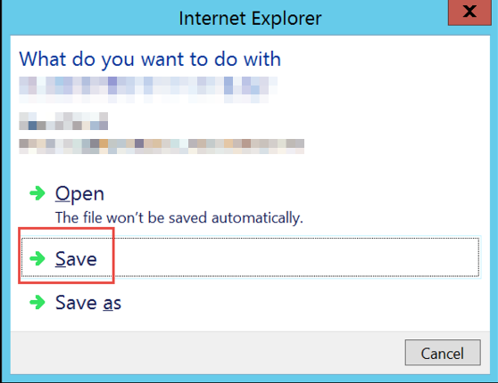

Azure Resource Manager

Before the hands-on lab setup guide

June 2018

Information in this document, including URL and other Internet Web site references, is subject to change without notice. Unless otherwise noted, the example companies, organizations, products, domain names, e-mail addresses, logos, people, places, and events depicted herein are fictitious, and no association with any real company, organization, product, domain name, e-mail address, logo, person, place or event is intended or should be inferred. Complying with all applicable copyright laws is the responsibility of the user. Without limiting the rights under copyright, no part of this document may be reproduced, stored in or introduced into a retrieval system, or transmitted in any form or by any means (electronic, mechanical, photocopying, recording, or otherwise), or for any purpose, without the express written permission of Microsoft Corporation.

Microsoft may have patents, patent applications, trademarks, copyrights, or other intellectual property rights covering subject matter in this document. Except as expressly provided in any written license agreement from Microsoft, the furnishing of this document does not give you any license to these patents, trademarks, copyrights, or other intellectual property.

The names of manufacturers, products, or URLs are provided for informational purposes only and Microsoft makes no representations and warranties, either expressed, implied, or statutory, regarding these manufacturers or the use of the products with any Microsoft technologies. The inclusion of a manufacturer or product does not imply endorsement of Microsoft of the manufacturer or product. Links may be provided to third party sites. Such sites are not under the control of Microsoft and Microsoft is not responsible for the contents of any linked site or any link contained in a linked site, or any changes or updates to such sites. Microsoft is not responsible for webcasting or any other form of transmission received from any linked site. Microsoft is providing these links to you only as a convenience, and the inclusion of any link does not imply endorsement of Microsoft of the site or the products contained therein.

© 2018 Microsoft Corporation. All rights reserved.

Microsoft and the trademarks listed at <https://www.microsoft.com/en-us/legal/intellectualproperty/Trademarks/Usage/General.aspx> are trademarks of the Microsoft group of companies. All other trademarks are property of their respective owners.

**Contents**

<!-- TOC -->

- [Azure Resource Manager before the hands-on lab setup guide](#azure-resource-manager-before-the-hands-on-lab-setup-guide)
    - [Requirements](#requirements)
    - [Before the hands-on lab](#before-the-hands-on-lab)
        - [Task 1: Create a virtual machine for your lab environment](#task-1-create-a-virtual-machine-for-your-lab-environment)
        - [Task 2: Connect to the VM and download the student files](#task-2-connect-to-the-vm-and-download-the-student-files)
        - [Task 3: Validate connectivity to Azure](#task-3-validate-connectivity-to-azure)

<!-- /TOC -->

# Azure Resource Manager before the hands-on lab setup guide

## Requirements

1.  Azure Subscription

2.  Understanding of Azure Infrastructure as a Service components

3.  Familiarity with JavaScript Object Notation (JSON)

4.  Familiarity with PowerShell

## Before the hands-on lab

Duration: 15 minutes

Prior to attending the lab, follow the instructions below to create a
lab environment using an Azure Virtual Machine and download the needed
files for the lab exercise.

### Task 1: Create a virtual machine for your lab environment 

1.  Launch a browser using incognite or in-private mode, and navigate to
    <https://portal.azure.com>. Once prompted, login with your Microsoft
    Azure credentials. If prompted, choose whether your account is an
    organization account or just a Microsoft Account.

2.  Click on +NEW, and in the search box, type in Visual Studio
    Community 2017, and press enter. Click
    the Visual Studio Community 2017 image running on Windows Server
    2016 and with the latest update.

3.  In the returned search results, click the image name

    

4.  In the Marketplace solution blade, click **Create**

5.  Set the following configuration on the Basics tab, and select **OK**:

    -   Name: **LABVM**

    -   VM disk type: **Premium SSD**

    -   User name: **demouser**

    -   Password: **demo\@pass123**

    -   Subscription: **If you have multiple subscriptions choose the subscription to execute your labs in**

    -   Resource Group: **OPSLABRG**

    -   Location: **Choose the closest Azure region to you**

6.  Choose the **DS1\_V2 Standard** instance size on the Size blade.

7.  On the Settings blade, choose **RDP (3389)** on the Select public inbound ports dropdown.

    

8.  Accept the remaining default values on the Settings blade, and click
    **OK**. On the Summary page, click **Create**. The deployment should
    begin provisioning. It may take more than 10 minutes for the virtual
    machine to complete provisioning.

    

### Task 2: Connect to the VM and download the student files

1.  Move back to the Portal page on your local machine, and wait for **LABVM** to show the Status of **Running**. Click **Connect** to establish a new Remote Desktop Session.

    

2.  Depending on your remote desktop protocol client and browser
    configuration, you will either be prompted to open an RDP file, or
    you will need to download it and then open it separately to connect.
    You may also be required to click, **Use a different account**.

    

3.  Login with the credentials specified during creation:

    a.  User: **demouser**

    b.  Password: **demo\@pass123**

4.  You will be presented with a Remote Desktop Connection warning because of a certificate trust issue. Click, **Don't ask me again for connections to this computer** followed by clicking **Yes** to continue with the connection.

    

5.  When logging on for the first time, you will see a prompt on the right asking about network discovery. Select **No**.

    

6.  Notice the Server Manager opens by default. On the left, click **Local Server**

    

7.  On the right side of the pane, click **On** by **IE Enhanced Security Configuration**

    

8.  Change to **Off** for Administrators, and click **OK**

    

9.  In the lower left corner, click Internet Explorer to open it. On
    first use, you will be prompted about security settings. Accept the
    defaults by clicking **OK**.

    

10. If prompted, click **Don't show this again** regarding protected mode.

11. Open Internet options by clicking the **Tools** icon in the upper right corner, then selecting **Internet options**.

    

12. Switch to the **Security** tab, verify that **Internet** is selected, then click the **Custom level...** button.

    

13. In the Settings pane, set the **File download** setting to **Enable** and click **OK**.
    
    

14. To download the exercise files for the lab, paste this URL into the browser:

    <https://cloudworkshop.blob.core.windows.net/arm-hackathon/ARM_Hackathon_Guide_Student_Files.zip>

15. You will be prompted about what you want to do with the file. Select **Save**.

    

16. Download progress is shown at the bottom of the browser window. When the download is complete, click **Open folder**.

    

17. The **Downloads** folder will open. ***Right-click*** the zip file, and click **Extract All**. In the **Extract Compressed (Zipped) Folders** window, enter **C:\\Hackathon** in the **Files will be extracted to this folder** dialog. Click the **Extract** button.

### Task 3: Validate connectivity to Azure

1.  Within the virtual machine, launch **Visual Studio 2017**, and
    validate you can login with your Microsoft Account when prompted

    

2.  Validate connectivity to your Azure subscription. Launch **Visual Studio**, open **Server Explorer** from the View menu, and ensure you can connect to your Azure subscription

    

You should follow all steps provided *before* attending the hands-on lab.
